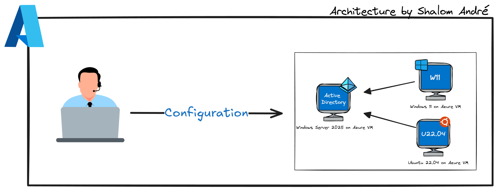
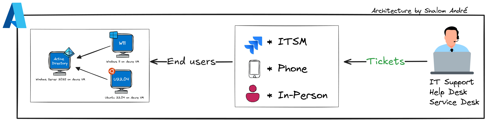
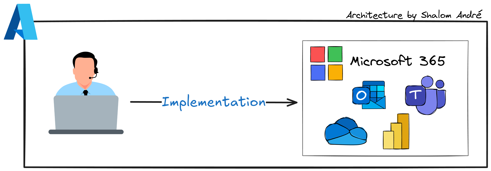
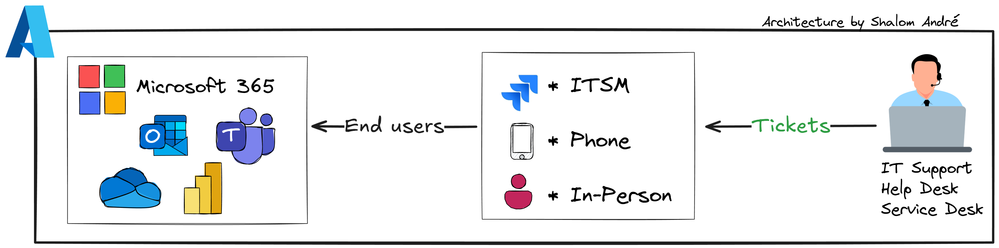
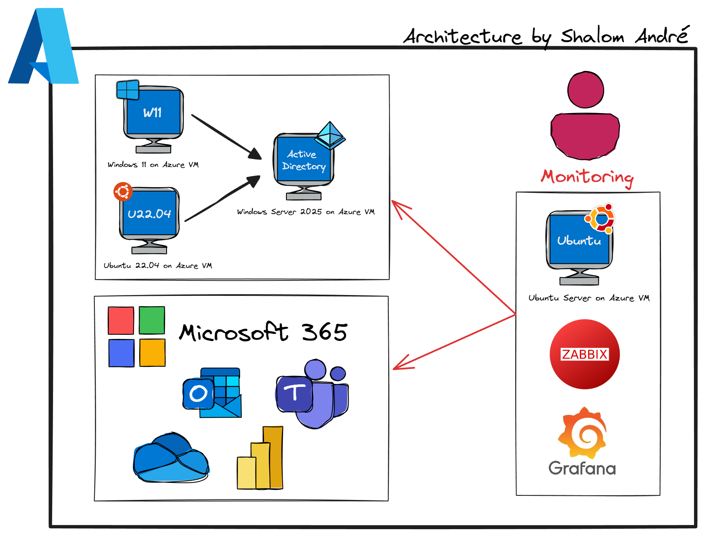

# Arquitetura em Azure com Monitoramento e Microsoft 365


## Descrição do Projeto
Este projeto demonstra a implementação de uma infraestrutura híbrida utilizando **Microsoft Azure**, **Active Directory**, **Microsoft 365**, e ferramentas de monitoramento como **Zabbix** e **Grafana**. O objetivo é criar um ambiente corporativo seguro, escalável e monitorado, com integração entre sistemas Windows e Linux.

---

## Arquitetura
A arquitetura é composta pelos seguintes elementos:

- **Máquinas Virtuais no Azure**
  - Windows 11 para estação de trabalho.
  - Windows Server 2025 para Active Directory.
  - Ubuntu 22.04 para serviços adicionais e monitoramento.
- **Microsoft 365**
  - Integração com Outlook, Teams, SharePoint e Power BI.
- **Monitoramento**
  - Zabbix para coleta de métricas.
  - Grafana para visualização e dashboards.

---

## Tecnologias Utilizadas
- **Cloud**: Microsoft Azure
- **Infraestrutura como Código**: Terraform
- **Automação**: PowerShell
- **Monitoramento**: Zabbix + Grafana
- **Sistemas Operacionais**: Windows 11, Windows Server 2025, Ubuntu 22.04
- **Microsoft 365**: Outlook, Teams, SharePoint, Power BI

---

## Objetivos
- Provisionar VMs no Azure usando Terraform.
- Configurar Active Directory no Windows Server.
- Integrar usuários e grupos com Microsoft 365.
- Implementar monitoramento com Zabbix e dashboards no Grafana.
- Garantir boas práticas de segurança, escalabilidade e troubleshooting.

---

## Passos para Implementação
### 1. Provisionamento no Azure

- Criar recursos via Terraform:
  - VNet, Subnets, NSG.
  - VMs (Windows e Linux).
- Configurar IPs e regras de firewall.

#### Exemplo de Código Terraform
```hcl
provider "azurerm" {
  features {}
}

resource "azurerm_resource_group" "rg" {
  name     = "rg-azure-project"
  location = "East US"
}

resource "azurerm_virtual_network" "vnet" {
  name                = "vnet-azure"
  address_space       = ["10.0.0.0/16"]
  location            = azurerm_resource_group.rg.location
  resource_group_name = azurerm_resource_group.rg.name
}

resource "azurerm_network_interface" "nic" {
  name                = "nic-vm"
  location            = azurerm_resource_group.rg.location
  resource_group_name = azurerm_resource_group.rg.name
}

resource "azurerm_windows_virtual_machine" "vm" {
  name                = "win11-vm"
  resource_group_name = azurerm_resource_group.rg.name
  location            = azurerm_resource_group.rg.location
  size                = "Standard_B2s"
  admin_username      = "adminuser"
  admin_password      = "Password123!"
  network_interface_ids = [azurerm_network_interface.nic.id]
  os_disk {
    caching              = "ReadWrite"
    storage_account_type = "Standard_LRS"
  }
  source_image_reference {
    publisher = "MicrosoftWindowsDesktop"
    offer     = "Windows-11"
    sku       = "win11-21h2-pro"
    version   = "latest"
  }
}
```

## 2. Configuração do Active Directory

- Instalar e promover o Windows Server como **Domain Controller**.
- Criar usuários e grupos.

---

## 3. Troubleshooting Comum no Windows Server & Workstation

- Problemas de DNS e resolução de nomes.
- Falhas na replicação do Active Directory.
- Erros de autenticação (**Kerberos/NTLM**).
- Políticas de Grupo (**GPO**) não aplicando corretamente.

---

## 4. Integração com Microsoft 365

- Sincronizar AD com **Azure AD**.
- Configurar licenças e permissões.

---

## 5. Troubleshooting Comum no Microsoft 365

- Problemas de login e autenticação multifator.
- Falhas na sincronização de e-mails (**Outlook**).
- Erros de **Teams** (conexão e chamadas).
- Permissões incorretas no **SharePoint**.

---

## 6. Monitoramento


- Instalar **Zabbix Server** no Ubuntu.
- Configurar agentes nas VMs.
- Criar dashboards no **Grafana**.

---

## Diagrama da Arquitetura
*(Imagem incluída no repositório)*

---

## Autor


[LinkedIn](https://www.linkedin.com/) | [YouTube](https://www.youtube.com/channel/UC7c3-2DMDQcFIy9CgX7GiuQ&sub_confirmation=1)
